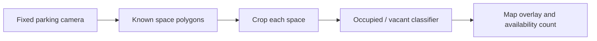

# Robust Vision-Based Parking Occupancy Monitoring

> An application-oriented capstone project on parking-space occupancy classification that remains reliable across different parking lots, cameras, weather, and lighting conditions.

## Project status

- **Stage:** Semester 1, Week 1
- **Compute environment:** Kaggle notebooks only
- **Current activity:** Reproducing the ACPDS paper baseline
- **Topic status:** Working direction; confirm the final wording with the advisor after the first cross-dataset experiment

## Problem statement

Most public parking-occupancy models report strong results when training and testing on frames from the same parking lot. This can overestimate real-world performance because nearby video frames share the same camera, background, weather, and parked vehicles. This project studies whether a model trained on one set of parking lots can generalize to an unseen lot and to different weather or lighting conditions.

The initial system assumes that parking-space polygons are already known. Each polygon is cropped from a fixed-camera image and classified as **occupied** or **vacant**.

## Application workflow



## Research questions

1. How much does performance decrease when the test parking lot or dataset is unseen during training?
2. Can weather- and lighting-aware augmentation improve cross-lot and cross-dataset generalization?
3. Which lightweight backbone provides the best accuracy–latency trade-off for a practical parking-monitoring application?

## Tentative contributions

1. A reproducible evaluation protocol that separates parking lots/cameras and prevents adjacent-frame data leakage.
2. An empirical study of weather- and lighting-aware augmentation for unseen parking lots.
3. A lightweight end-to-end prototype that reports occupancy, latency, throughput, and model size—not accuracy alone.

The project does **not** need a new neural-network architecture to be a valid undergraduate contribution. A carefully designed benchmark, a justified improvement, honest ablations, and a working application are sufficient.

## Scope

### In scope

- Image-based occupied/vacant classification
- Fixed cameras and predefined parking-space polygons
- Cross-parking-lot and cross-dataset evaluation
- Weather and lighting robustness
- Lightweight CNN comparison
- Kaggle training and evaluation
- Image/video overlay prototype and occupancy statistics

### Out of scope for the first version

- License-plate recognition, payment, reservations, or user accounts
- Vehicle tracking
- IoT sensor fusion
- Fully automatic parking-slot localization

Automatic slot localization may become future work only after the classification pipeline is reliable.

## Datasets

| Role | Dataset | Planned use |
|---|---|---|
| Reproduction | ACPDS | Reproduce the official image-based baseline and verify the pipeline |
| Main benchmark | PKLot | Weather-aware training and parking-lot-separated evaluation |
| External test | CNRPark+EXT | Measure cross-dataset generalization |
| Optional future work | Tongji ps2.0, SNU, SUPS | Automatic parking-slot detection/localization |

See [the dataset catalogue](docs/literature-review/datasets.md) for sizes, labels, sources, and limitations.

## Literature map

The repository currently tracks:

- **17 parking-specific papers** covering occupancy classification, transfer learning, robustness, automatic slot detection, and surveys.
- **5 improvement-method papers** covering RandAugment, AugMix, MixStyle, Deep CORAL, and Tent.
- **6 candidate datasets**, with only three selected for the main experiments.

See [the paper table](docs/literature-review/paper-table.md) and [method-improvement plan](docs/literature-review/method-improvement.md).

## Experiment roadmap

| ID | Experiment | Purpose |
|---|---|---|
| EXP-001 | Reproduce ACPDS official baseline | Verify data, training, and evaluation pipeline |
| EXP-002 | ResNet18 / MobileNetV3 / EfficientNet-B0 | Establish modern lightweight baselines |
| EXP-003 | Leave-one-parking-lot-out evaluation | Measure unseen-lot generalization |
| EXP-004 | PKLot → CNRPark+EXT | Measure cross-dataset domain gap |
| EXP-005 | Weather/lighting augmentation | Test the main practical improvement |
| EXP-006 | RandAugment and AugMix | Compare general-purpose robustness methods |
| EXP-007 | MixStyle | Test feature-statistics domain generalization |
| EXP-008 | Deep CORAL or Tent (optional) | Test adaptation only if a clear domain gap exists |
| EXP-009 | Accuracy–efficiency comparison | Latency, throughput, memory, and model size |
| EXP-010 | Application demo | Parking overlay and available-space count |

## Evaluation protocol

Report accuracy, balanced accuracy, macro F1, per-class precision/recall, confusion matrix, inference latency, spaces per second, model size, and peak memory.

**Critical rule:** split by parking lot, camera, capture session, or official sequence—not by randomly shuffling adjacent frames. Near-duplicate frames in train and test would produce misleadingly high results.

## Semester 1 plan

| Week | Milestone |
|---:|---|
| 01 | Confirm scope, catalogue literature/datasets, run ACPDS notebook |
| 02 | Finish ACPDS reproduction and document reproducibility gaps |
| 03 | Prepare PKLot and reproduce a modern lightweight baseline |
| 04 | Establish parking-lot-separated evaluation |
| 05 | Run first PKLot → CNRPark+EXT experiment |
| 06 | Analyze errors by weather, illumination, and camera |
| 07–08 | Implement weather/lighting augmentation baseline |
| 09–10 | Compare RandAugment and AugMix |
| 11–12 | Evaluate MixStyle; decide whether adaptation is justified |
| 13–14 | Efficiency benchmark and ablations |
| 15–16 | Build application prototype |
| 17–18 | Consolidate results and write Semester 1 report |

## Repository structure

```text
special_project/
├── configs/                     # Experiment configurations
├── docs/
│   ├── literature-review/       # Paper, dataset, and method catalogue
│   ├── weekly-logs/             # Weekly decisions and evidence
│   └── project-scope.md         # Scope and acceptance criteria
├── experiments/                 # One folder/README per experiment
├── notebooks/
│   └── acpds-paper-reproduction-kaggle.ipynb
├── results/                     # Small tables/figures; no model weights
├── src/                         # Reusable training/evaluation/application code
└── requirements.txt
```

## Reproduction notebook

Open `notebooks/acpds-paper-reproduction-kaggle.ipynb` in Kaggle, enable a GPU accelerator, and run the cells in order. The notebook clones the official repository, checks the environment, downloads ACPDS, evaluates the pretrained model, provides a short smoke-training run, and exports the outputs.

## Reproducibility rules

- Record the Git commit, dataset version, split, seed, model, image size, epochs, batch size, GPU, and runtime.
- Never commit datasets, checkpoints, Kaggle credentials, or large generated outputs.
- Save compact CSV/JSON metrics and selected figures under `results/`.
- Keep claims proportional to the evidence; negative results are still useful when the protocol is sound.

## Pivot history

The repository explored UAV small-object detection and medication verification before settling on parking occupancy monitoring. Earlier files are retained as project history; they are not part of the active research scope.

## Core external resources

- [ACPDS paper](https://arxiv.org/abs/2107.12207) and [official code/data](https://github.com/martin-marek/parking-space-occupancy)
- [PKLot official dataset](https://web.inf.ufpr.br/vri/databases/parking-lot-database/)
- [CNRPark+EXT paper and dataset record](https://openportal.isti.cnr.it/doc?id=people______::f0ae3d0d7a052b367753c8a217c77897)
- [Systematic review of vision-based parking occupancy detection](https://arxiv.org/abs/2203.06463)

