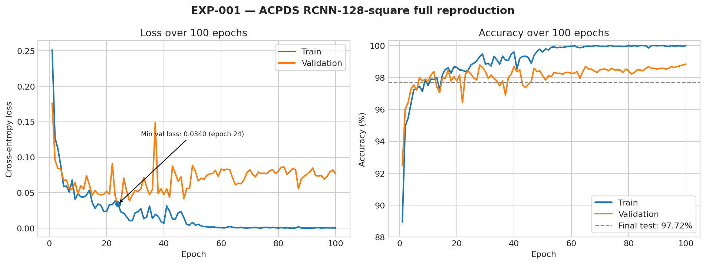

# EXP-001 — ACPDS Paper Reproduction

## Objective

Verify that the official implementation of *Image-Based Parking Space Occupancy Classification: Dataset and Baseline* can be executed on a current Kaggle environment, reproduce the official pretrained result, and independently train one complete baseline.

## Source

- Paper: https://arxiv.org/abs/2107.12207
- Official repository: https://github.com/martin-marek/parking-space-occupancy
- Official commit: `17da2c8b33055be8019483260f0efbcbdfda0478`
- Reproduction notebook: `notebooks/acpds-paper-reproduction-kaggle.ipynb`

## Configuration

| Field | Value |
|---|---|
| Dataset | ACPDS / Action-Camera Parking Dataset |
| Model | `RCNN_128_square` |
| Backbone | ImageNet-pretrained ResNet50 |
| ROI resolution | 128 × 128 |
| Pooling | Square |
| Full training | 100 epochs |
| Learning rate | `1e-4`, decayed after epoch 50 by the official training code |
| Seed | 42 |
| Python | 3.12.13 |
| PyTorch | 2.10.0+cu128 |
| Torchvision | 0.25.0+cu128 |
| GPU | Tesla T4, CUDA capability 7.5 |

## Results

| Run | Epochs | Test loss | Test accuracy |
|---|---:|---:|---:|
| Official pretrained checkpoint | — | 0.1695 | **97.99%** |
| Smoke training | 5 | 0.0934 | 96.44% |
| Independent full training | 100 | 0.1711 | **97.72%** |
| Paper, `RCNN-128-square` | 100 | — | **97.97 ± 0.07%** |

The independently trained result is 0.25 percentage points below the paper mean. The official pretrained checkpoint produces 97.9866%, closely matching the paper's 97.97% result.

## Training observations

- Final training accuracy: 100.00%.
- Final validation accuracy: 98.84%.
- Highest validation accuracy: 98.84% at epoch 100.
- Lowest validation loss: 0.0340 at epoch 24.
- Final validation loss: 0.0766.

Validation loss begins increasing after its minimum while validation accuracy remains high. This suggests growing confidence/overfitting in the loss even though classification accuracy remains stable. Future experiments should save both the last checkpoint and the checkpoint selected by a validation criterion.



## Reproduction assessment

**Status: successful close reproduction.**

The result verifies that dataset loading, preprocessing, ROI pooling, training, validation, test evaluation, and checkpoint export all work on Kaggle. It is not called an exact statistical replication because only one independent 100-epoch seed was trained and the current PyTorch/Torchvision/CUDA environment differs from the original environment.

This experiment does not establish a new contribution or cross-dataset robustness. Its purpose is to provide a trusted starting point before evaluating modern lightweight models and unseen-domain performance.

## Committed artifacts

```text
results/EXP-001-acpds-reproduction/
├── reproduction_summary.json
├── training_curves.png
├── full/
│   ├── train_log.csv
│   └── test_logs.json
└── smoke/
    ├── train_log.csv
    └── test_logs.json
```

## Excluded large artifacts

The following files were retained outside Git because each checkpoint is roughly 94 MB:

| Artifact | SHA-256 |
|---|---|
| Smoke `weights_last_epoch.pt` | `e6e6641b309b03ada6a905ac84af0ad2c1057709a3768ecac6126adbbf7406d7` |
| Full `weights_last_epoch.pt` | `ce3949854373ec58627647b0a6ff3ee88fdac1a2825030b430fa6d1aba2fde15` |
| Original result ZIP | `a39e1233867e5bc325286115fcb0b2af1b667e2d17d056c3dcdd181fe3f6a59b` |

## Next experiment

Create EXP-002 using a maintained lightweight classifier such as ResNet18, MobileNetV3, or EfficientNet-B0. Fix the split and evaluation protocol before adding weather augmentation or domain-generalization methods.

